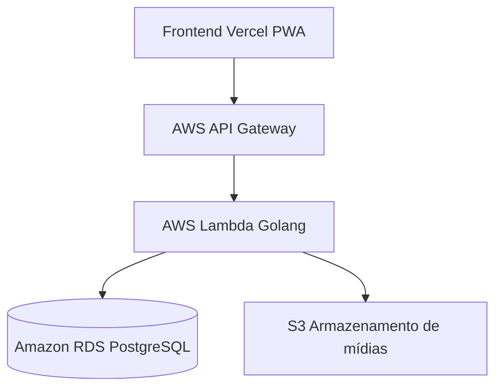

# 🏋️‍♂️ EvoluFit — Progressive Web App de Monitoramento de Treinos

**EvoluFit** é um **PWA (Progressive Web App)** voltado para o **monitoramento físico** e **acompanhamento do progresso de treinos**, com foco em:

- ⚡ **Performance**
- 📱 **Praticidade**
- 🎨 **Design responsivo**

O objetivo é permitir que o usuário acompanhe **treinos, metas e evolução corporal diretamente do navegador**, sem depender de integrações externas — **por enquanto**.

---

## 🚧 Estado Atual do Projeto

Atualmente, o projeto **ainda está na fase inicial de preparação**.  
Nenhuma linha de código do MVP foi desenvolvida até o momento — apenas **configurações iniciais na AWS** foram feitas, como parte do planejamento de infraestrutura.

As etapas concluídas até agora incluem:

- Planejamento de arquitetura em nuvem (AWS);
- Configuração básica de contas e permissões iniciais;
- Estruturação de repositórios no GitHub para colaboração.

O **desenvolvimento do MVP** (Produto Mínimo Viável) ainda será iniciado, com foco em **prototipar as principais funcionalidades** do EvoluFit.

---

## 🧩 Objetivo do MVP

O MVP do **EvoluFit** visa construir uma base funcional que permita:

- Criar e acompanhar **rotinas de treino personalizadas**;
- Registrar **progresso corporal** (peso, medidas, fotos, etc.);
- Definir **metas e desafios individuais**;
- Visualizar **evolução em gráficos e tabelas**;
- (Futuro) Participar de **competições com amigos** e comparar desempenho.

---

## 🌐 Arquitetura Geral

A aplicação foi pensada com uma arquitetura **serverless e escalável**, utilizando serviços AWS integrados com o PWA hospedado na Vercel.

## 🛠️ Stack Planejada

| **Camada** | **Tecnologia / Serviço** | **Descrição** |
|-------------|---------------------------|----------------|
| **Frontend** | PWA (Vercel + HTML/CSS/JS + Framework futuro) | Interface leve e responsiva acessível via navegador. |
| **Backend** | Go (Golang) + AWS Lambda | Lógica de negócio e APIs serverless. |
| **Banco de Dados** | Amazon RDS (PostgreSQL) | Armazenamento de dados estruturados. |
| **Armazenamento de Mídias** | Amazon S3 | Armazenamento de imagens e fotos de evolução. |
| **API Gateway** | AWS API Gateway | Intermediário entre o PWA e as funções Lambda. |
| **Infraestrutura** | AWS Cloud (Free Tier) | Base inicial para hospedagem e testes do MVP. |

---

## 🧠 Visão Futura

Após o MVP, o **EvoluFit** poderá evoluir com:

- 📊 **Dashboards personalizados** com métricas de performance;  
- 🧬 **Integrações com APIs externas** (Google Fit, Samsung Health, Apple Health);  
- 🧑‍🤝‍🧑 **Módulo social** para competições entre usuários;  
- 🔒 **Autenticação segura** e gestão de perfis;  
- ☁️ **Deploy automatizado** e CI/CD com GitHub Actions e AWS.

---

## 👥 Equipe

O projeto está sendo desenvolvido por:

| **Integrante** | **Função** |
|----------------|------------|
| [**Skdevr**](https://github.com/Skdevr) | AWS, DevOps & Appsec |
| [**wxn777**](https://github.com/wxn777) | Backend (Go) |
| [**Phepyn1**](https://github.com/Phepyn1) | Banco de Dados, Front-end |

---

## 🗓️ Progresso

| **Etapa** | **Status** | **Observação** |
|------------|------------|----------------|
| Planejamento de arquitetura | ✅ | Definida e validada |
| Preparação da AWS | ⚙️ | Em fase inicial |
| Desenvolvimento do backend (Go) | ⏳ | Ainda não iniciado |
| Integração PWA + API | ⏳ | Aguardando backend |
| MVP funcional | 🔜 | Meta da próxima fase |

---

💡 *Este repositório faz parte da fase inicial do desenvolvimento do EvoluFit, focando na consolidação da infraestrutura em nuvem e nas bases para o MVP.*
